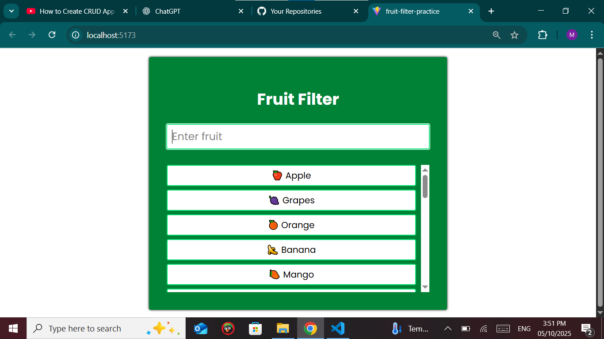

# 🍎 Fruit Filter App

A simple React application built with **TailwindCSS** that allows users to filter a list of fruits in real-time as they type. This project demonstrates the use of **React Hooks** (`useState`, `useMemo`) and dynamic rendering with a clean, responsive UI.

---

## 🚀 Features

* 🔎 Real-time fruit filtering
* 🎨 Styled with TailwindCSS
* ⚡ Efficient rendering using `useMemo`
* 📱 Responsive design

---

## 📸 Screenshots



---

## 🛠️ Tech Stack

* **React** – Component-based UI
* **TailwindCSS** – Utility-first CSS framework
* **JavaScript (ES6+)**

---

## 📂 Installation & Setup

Clone the repository and install dependencies:

```bash
git clone https://github.com/Afnan-coder/fruit-filter-react-tailwind.git
cd fruit-filter-react-tailwind
npm install
npm run dev
```

The app will run on `http://localhost:5173/`

---

## 📸 Demo Preview

```
Enter "apple" → Shows 🍎 Apple & 🍏 Green Apple
Enter "man" → Shows 🥭 Mango
```


